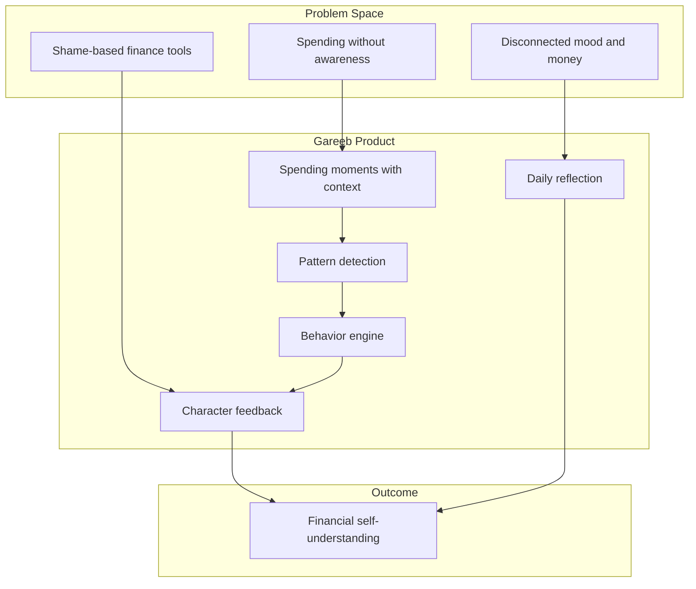
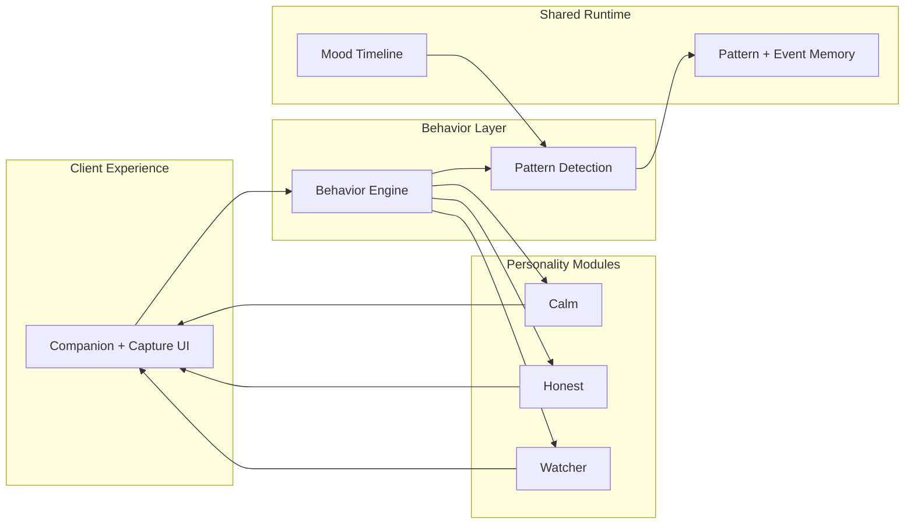
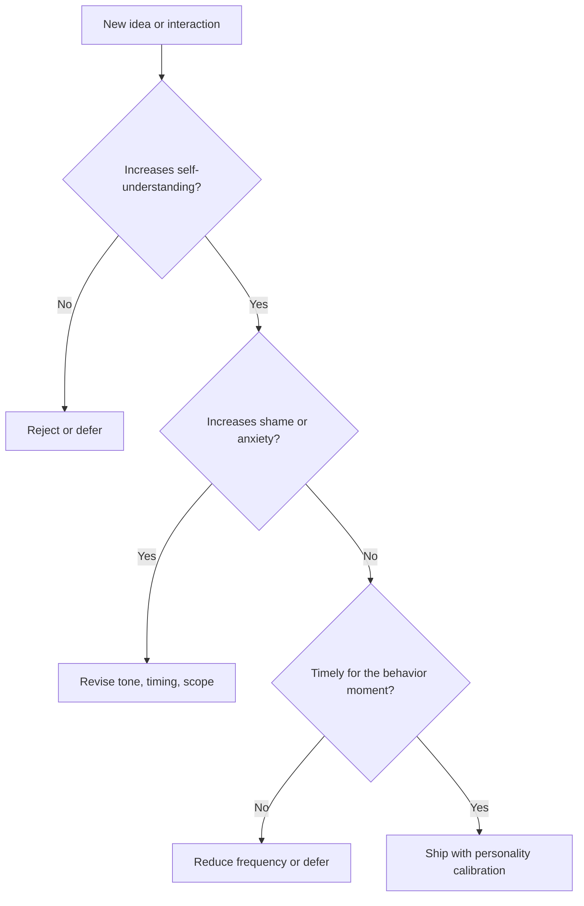
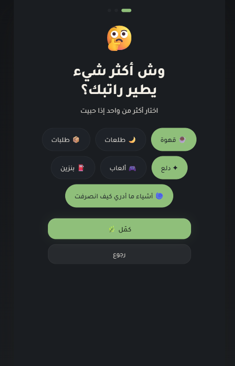
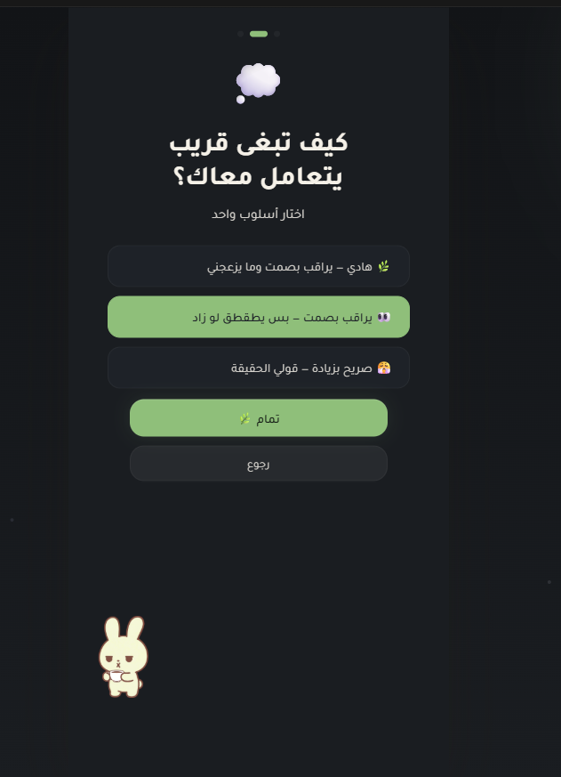
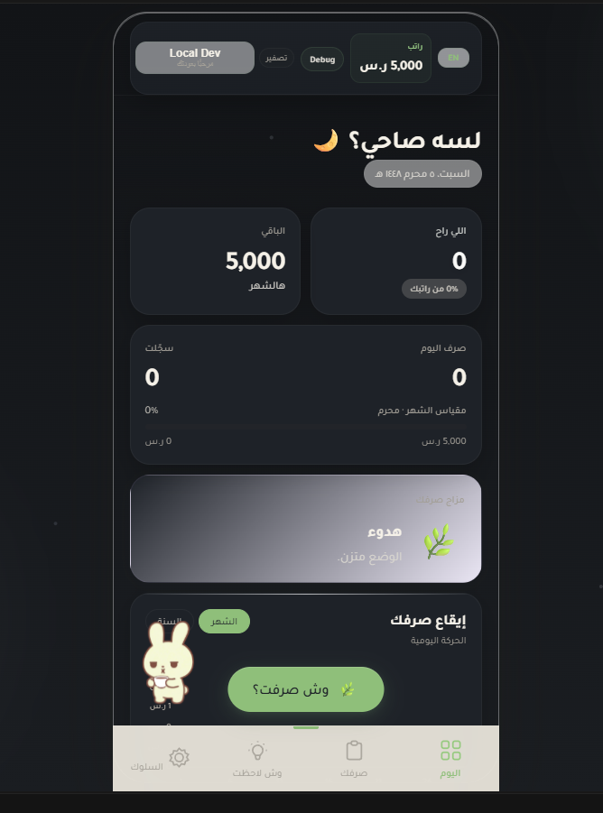
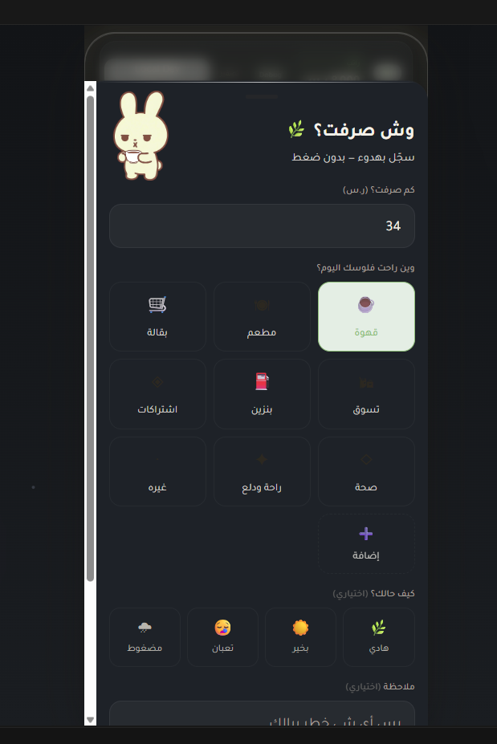
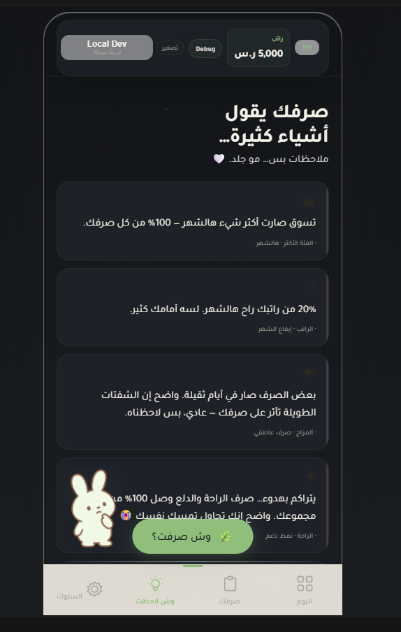

<p align="center">
  
</p>

<p align="center">
  <strong>Gareeb</strong> · Behavioral Finance Companion<br>
  <em>A system that helps users understand the story behind spending, not just the numbers.</em>
</p>

<p align="center">
  <a href="docs/product-context.md">Product Context</a> ·
  <a href="docs/design-philosophy.md">Design Philosophy</a> ·
  <a href="docs/behavioral-design.md">Behavioral Design</a> ·
  <a href="architecture/behavior-engine.md">Architecture</a>
</p>

---

## About This Repository

**Gareeb Showcase** is a public product documentation repository — not the production codebase.

It is structured for recruiters, hiring managers, Technical Program Managers, Product Managers, and engineering leaders who want to evaluate **product thinking**, **behavioral design**, **system architecture concepts**, and **decision rationale** without implementation exposure.

| This repo contains | This repo does not contain |
|--------------------|----------------------------|
| Product case study documentation | Production source code |
| Architecture concepts | API keys or deployment configs |
| Design rationale and frameworks | Proprietary business logic |
| Character system documentation | Live application binaries |

---

## The Problem

Most personal finance products optimize for **recording** and **reporting**. Users download them after a stressful moment, log diligently for two weeks, then leave when the product makes them feel worse — not better — about their behavior.

The gap is not data. The gap is **interpretation**, **timing**, and **tone**.

| What users ask | What most tools answer |
|----------------|------------------------|
| Why does this keep happening? | Here is your total |
| What mood drives this pattern? | Here is a pie chart |
| Can something notice without judging? | Here is a red budget bar |

---

## The Gareeb Approach

Gareeb is a **behavioral finance companion** — a product designed to help people understand spending habits through pattern recognition, reflective insights, emotional UX, and character-driven feedback.



> **Positioning note:** Gareeb is intentionally not marketed as an expense tracker. Tracking is an input layer. The product value is **behavioral awareness**.

---

## Product Capabilities

| Capability | Product role |
|------------|--------------|
| **Spending tracking** | Capture behavior moments with category and mood |
| **Pattern detection** | Surface repetition across time, category, and emotion |
| **Behavioral insights** | Translate signals into readable observations |
| **Character-driven feedback** | Deliver insight through a chosen companion voice |
| **Personality modes** | Calm, Honest, Watcher — tone as product architecture |
| **Daily reflections** | Mood notes that parallel the spending timeline |
| **Awareness journeys** | Onboarding and monthly rhythms that build understanding |
| **Emotional UX** | Calm visuals, pacing, and language that reduce finance anxiety |

---

## Product Philosophy

Three principles govern every major decision:

1. **Awareness before control** — users must understand patterns before they can change them.
2. **The story behind the number** — amount is only one field in a behavioral moment.
3. **Tone is a feature** — the same insight lands differently depending on companion personality.

Full framework: [Design Philosophy](docs/design-philosophy.md)

---

## Personality System

Users select how they want to be mirrored:

| Personality | Stance | Best for |
|-------------|--------|----------|
| **Calm** | Gentle, de-escalating | Anxiety-sensitive users |
| **Honest** | Direct, consistent | Users who rationalize patterns |
| **Watcher** | Quiet, observational | Users who prefer minimal copy |

Personalities share a behavioral stage ladder (Normal → Suspicious → Warning → Critical) but **express each stage differently**.

Deep dive: [Personalities](docs/personalities.md) · [Personality System Architecture](architecture/personality-system.md)

---

## Architecture (Conceptual)

Gareeb separates **orchestration** from **personality interpretation** from **shared behavioral memory**.



| Document | Focus |
|----------|-------|
| [Behavior Engine](architecture/behavior-engine.md) | Signal → response composition |
| [Personality System](architecture/personality-system.md) | Modular character architecture |
| [Pattern Detection](architecture/pattern-detection.md) | Recognition logic and memory |

---

## Before vs With Gareeb

| Dimension | Conventional tools | Gareeb |
|-----------|-------------------|--------|
| Primary unit | Transaction | Behavior moment |
| Feedback | Alerts and charts | Reflection and character |
| Emotional stance | Neutral or punitive | Calibrated companionship |
| Success | Log completeness | Awareness quality |
| Long-term goal | Budget adherence | Self-understanding |

Full comparison: [Before vs With Gareeb](docs/before-vs-with-gareeb.md)

---

## Documentation Map

```
gareeb-showcase/
├── README.md                          ← You are here
├── assets/
│   ├── gareeb-banner.svg
│   ├── gareeb-logo.png
│   └── gareeb-logo.svg
├── architecture/
│   ├── behavior-engine.md
│   ├── personality-system.md
│   └── pattern-detection.md
├── docs/
│   ├── README.md
│   ├── product-context.md
│   ├── design-philosophy.md
│   ├── behavioral-design.md
│   ├── before-vs-with-gareeb.md
│   ├── personalities.md
│   └── glossary.md
└── screenshots/
    ├── README.md
    ├── 01-onboarding-welcome.png
    ├── … (15 product captures)
    └── 15-behavior-insights-patterns.png
```

Start with [docs/product-context.md](docs/product-context.md) for the full problem framing.

---

## Project Impact

### Product impact

| Area | Impact |
|------|--------|
| **User relationship** | Reframes finance from judgment to companionship |
| **Retention psychology** | Users return on hard days when tone feels safe |
| **Behavior change lever** | Shortens gap between action and awareness |
| **Differentiation** | Character + personality as architecture, not marketing |

### Design impact

| Area | Impact |
|------|--------|
| **Emotional UX** | Finance product designed for calm first-open |
| **Inclusive feedback** | Multiple personalities respect different emotional bandwidths |
| **Anti-shame standard** | Explicit guardrails against punitive copy |

### Systems impact

| Area | Impact |
|------|--------|
| **Modular personalities** | Independent evolution of Calm, Honest, Watcher |
| **Clear ownership boundaries** | Orchestration vs interpretation vs shared memory |
| **Explainable insights** | Every user-facing message traceable to plain-language cause |

### What reviewers should take away

This project demonstrates:

- **Product thinking** — problem framing beyond feature lists
- **Behavioral finance application** — psychology-informed design without clinical claims
- **Architecture for growth** — personality modules without monolithic rewrite
- **TPM-ready boundaries** — orchestration, runtime, and module ownership
- **Content system design** — voice, threshold, and stage ladders as product infrastructure

---

## Decision Framework (Summary)

When evaluating any Gareeb feature:



Full framework: [Design Philosophy → Decision Framework](docs/design-philosophy.md#decision-framework)

---

## Future Vision

Gareeb is designed to grow as a **behavioral awareness platform**, not a feature-heavy finance dashboard.

| Horizon | Direction |
|---------|-----------|
| **Near** | Richer cross-category emotional signatures |
| **Mid** | Awareness journeys with milestone framing (non-punitive) |
| **Long** | Optional pre-decision pause moments — awareness at point of choice |

Roadmap items in this repository are **product direction statements**, not public commitments.

---

## Screenshots — جولة في التطبيق

| # | الصفحة | |
|---|--------|---|
| 1 | **ترحيب — الإعداد الأول** |  |
| 2 | **عادات الصرف** |  |
| 3 | **اختيار شخصية قريب** |  |
| 4 | **الرئيسية — أول دخول** |  |
| 5 | **إدخال مشترى / صرف** |  |
| 6 | **وش لاحظت — ملاحظات** |  |

**15 لقطة** مرتّبة بالكامل (إعداد → اليوم → صرف → قريب → ملاحظات): [`screenshots/README.md`](screenshots/README.md)

---

## Glossary

Shared vocabulary for behavioral finance companion concepts: [docs/glossary.md](docs/glossary.md)

---

## Author & Context

Built as a product case study demonstrating behavioral finance companion design — combining user psychology, emotional UX, modular architecture, and character-driven feedback systems.

**Repository type:** Public showcase · **Production code:** Private, not published here by design.

---

<p align="center">
  
</p>

<p align="center">
  <sub>Understanding the story behind spending — not just the numbers.</sub>
</p>
