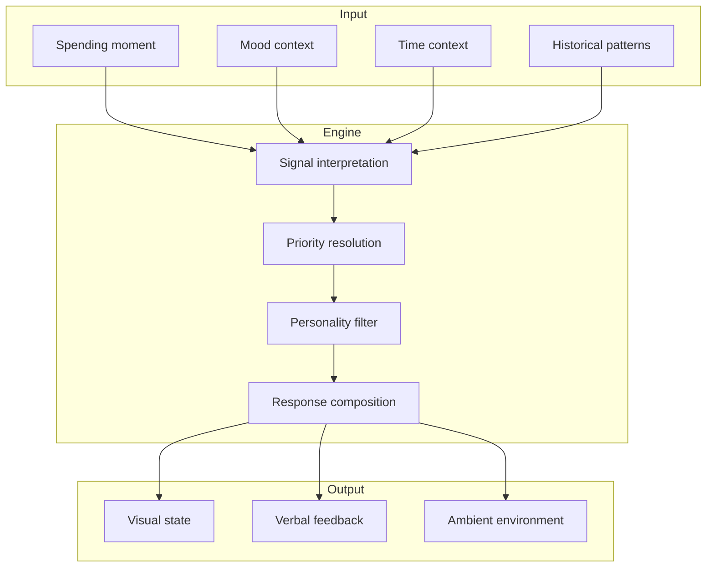
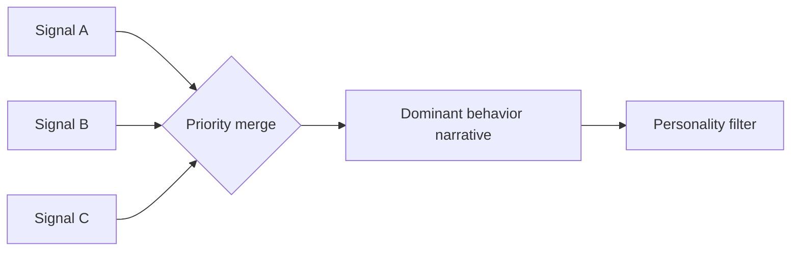

# Behavior Engine

Conceptual architecture for how Gareeb transforms raw spending activity into meaningful, personality-calibrated feedback.

> This document describes **system thinking** for product and technical reviewers. It does not expose production implementation.

---

## Purpose

The behavior engine answers one product question:

> *Given what just happened and what has happened before, what should the user feel understood about — and how should the companion express it?*

It is not a notification dispatcher. It is a **composition layer** between pattern memory and user experience.

---

## High-Level Flow

---

## Layer Responsibilities

| Layer | Responsibility | Must not |
|-------|----------------|----------|
| **Signal interpretation** | Classify moment severity and pattern relevance | Assume user intent |
| **Priority resolution** | Choose dominant signal when multiple fire | Stack conflicting alerts |
| **Personality filter** | Apply tone, threshold, and channel rules | Override user personality choice |
| **Response composition** | Assemble final experience | Expose raw scores to user |

---

## Signal Types

| Signal | Product meaning | Example |
|--------|-----------------|---------|
| **Category repetition** | Habit forming | Coffee multiple times before noon |
| **Amount anomaly** | Unusual weight for category | Large single comfort purchase |
| **Time cluster** | Situational habit | Late-night delivery pattern |
| **Mood correlation** | Emotional driver | Stressed mood on comfort categories |
| **Rhythm drift** | Pace change | Week spend accelerating vs baseline |
| **Inactivity** | Relationship signal | User absent; companion softens |

---

## Priority Resolution

When multiple signals activate simultaneously, the engine selects a **dominant narrative** — one insight the user can hold in mind.

### Resolution principles

1. **Safety over spectacle** — do not combine alarm types.
2. **Recency weighting** — the current moment matters, but repetition matters more.
3. **Personality channel fit** — Watcher prefers visual dominance; Honest prefers verbal clarity.
4. **Cooldown respect** — recent reactions suppress duplicate noise.

---

## Personality Filter

Each personality module applies:

| Parameter | Effect |
|-----------|--------|
| Threshold sensitivity | When stages advance |
| Verbal density | How much copy appears |
| Visual expressiveness | Animation and overlay intensity |
| Night behavior | How late-hour spending is handled |
| Cooldown duration | Time before next reaction |

The orchestration layer remains **personality-agnostic**. Personality-specific philosophy lives in isolated modules — a deliberate boundary for scalability and product clarity.

---

## Response Channels

| Channel | When used | Example |
|---------|-----------|---------|
| **Verbal** | Pattern needs naming | Short companion line |
| **Visual** | Mood shift sufficient | Companion expression change |
| **Ambient** | Low urgency or Watcher mode | Background tint, slower motion |
| **Silent** | Nothing meaningful to say | Presence without comment |

> **Product rule:** Silence is a valid output. Not every log deserves feedback.

---

## State and Memory Interaction

The behavior engine reads from shared runtime concepts:

| Memory type | Engine use |
|-------------|------------|
| **Event memory** | Recent actions and timestamps |
| **Pattern memory** | Cluster history and repetition counts |
| **Mood timeline** | Emotional correlation |
| **Streak context** | Continuity and absence |

It writes **reaction outcomes** back to memory so the product does not repeat the same observation ineffectively.

---

## Failure and Edge Cases

| Scenario | Product behavior |
|----------|------------------|
| First-ever entry | Welcome-oriented, low intensity |
| Missing mood | Pattern detection still runs on category/time |
| Personality mismatch | User can switch during onboarding replay |
| Backend unavailable | Client preserves calm defaults; no shame copy |
| Month rollover | Forward-looking reset; history preserved for reflection |

---

## Design Boundaries

### The engine does

- Interpret behavioral signals
- Respect personality philosophy
- Time responses for comprehension
- Maintain non-punitive framing

### The engine does not

- Provide investment advice
- Score user morality
- Optimize for engagement at cost of trust
- Replace professional financial guidance

---

## Scalability Rationale

Modular personality ownership allows:

- Independent tone tuning without cross-personality regressions
- New personalities without rewriting orchestration
- Clear TPM/engineering ownership boundaries
- A/B testing of threshold philosophy per personality

---

## Related Documents

- [Personality System](./personality-system.md)
- [Pattern Detection](./pattern-detection.md)
- [Behavioral Design](../docs/behavioral-design.md)
