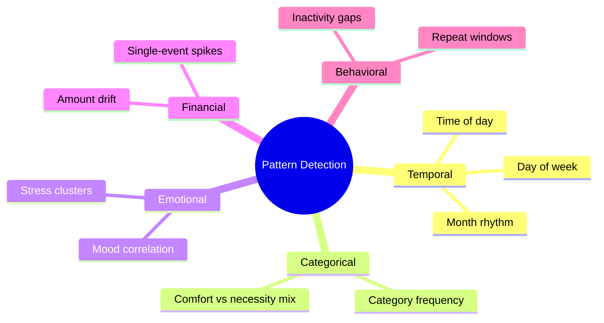
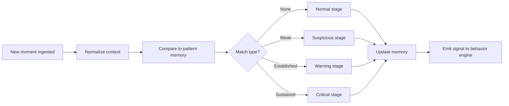

# Pattern Detection

Conceptual documentation for how Gareeb recognizes spending patterns and converts them into behavioral insight.

---

## Purpose

Pattern detection in Gareeb is not statistical reporting for its own sake. It exists to answer:

> *"What keeps happening that the user might not see while living their day?"*

The output is **recognition**, not prediction.

---

## Pattern vs Transaction

| Transaction view | Pattern view |
|------------------|--------------|
| Single event | Sequence or cluster |
| Amount in isolation | Amount in context |
| Category label | Category habit |
| Timestamp | Time-of-day rhythm |
| Static | Emerging or repeating |

Gareeb's product value increases when the user moves from **recording** to **recognizing**.

---

## Detection Dimensions

---

## Pattern Classes

| Class | Definition | Product use |
|-------|------------|-------------|
| **Repeat** | Same category within short window | "Again?" awareness |
| **Cluster** | Multiple related spends in session | Rush or impulse recognition |
| **Drift** | Gradual pace increase vs baseline | Monthly rhythm change |
| **Anomaly** | Outlier amount for category | Surprise moment |
| **Mood-linked** | Category correlated with mood label | Emotional driver insight |
| **Temporal** | Time-conditioned habit | Late-night, payday proximity |
| **Absence** | Logging or visit gap | Re-engagement softness |

---

## Detection Pipeline (Conceptual)

---

## Memory Model

### Event memory

Short-horizon record of recent moments — powers immediate repeat detection ("coffee again this morning").

### Pattern memory

Longer-horizon aggregation of clusters — powers weekly and monthly behavioral narratives.

| Memory horizon | Detects | Example |
|----------------|---------|---------|
| Minutes–hours | Immediate repeat | Second coffee order |
| Days | Daily rhythm | Late orders three nights |
| Weeks | Habit drift | Shopping share of total spend rising |
| Months | Seasonal self-comparison | Calmer month vs previous |

---

## Thresholds and Personality

Raw pattern confidence is **filtered by personality** before user-facing output.

| Pattern confidence | Calm may show | Honest may show | Watcher may show |
|--------------------|---------------|-----------------|------------------|
| Low | Nothing | Nothing | Ambient only |
| Medium | Soft hint | Direct line | Visual shift |
| High | Clear observation | Strong callout | Visual + brief text |
| Critical | Firm guidance | Explicit urgency | Rare verbal emphasis |

Same pattern, different **expression permission**.

---

## False Positive Philosophy

Finance apps often over-alert to prove intelligence. Gareeb prefers **under-alerting** to **trust erosion**.

| Principle | Rationale |
|-----------|-----------|
| Require repetition before strong language | One coffee is not a habit |
| Decay old patterns | People change; memory should forgive |
| Suppress duplicate insights | Same message twice feels broken |
| Prefer questions over accusations | Opens reflection |

---

## Explainability Standard

Every user-facing insight must be traceable to a **plain-language cause**:

| Acceptable | Not acceptable |
|------------|----------------|
| "Coffee showed up three times before noon this week" | "Anomaly score 0.82" |
| "Late-night orders clustered this week" | "Behavior model flagged risk" |
| "This was larger than your usual for this category" | "AI detected overspend" |

Reviewers should always be able to ask *"why did the user see this?"* and receive a human answer.

---

## Monthly Rollover Interaction

When a calendar month ends:

- Forward-looking awareness metrics reset
- Historical patterns remain available for reflection
- Product framing: **new chapter**, not **score reset punishment**

This supports long-term learning without carrying shame forward.

---

## Privacy and Scope

Pattern detection operates on **user-owned behavioral data** captured in-product. The showcase documentation does not describe cross-user analytics or external data brokerage.

Insights are for **self-understanding**, not advertising.

---

## Future Detection Capabilities

Product-level roadmap concepts (not commitments):

| Direction | Intent |
|-----------|--------|
| Cross-category emotional signatures | "Comfort spending" as a behavior, not a category |
| Journey milestones | Awareness achievements without gamified punishment |
| Comparative self windows | This month vs your typical rhythm |
| Pre-decision pause prompts | Optional awareness before capture |

---

## Related Documents

- [Behavior Engine](./behavior-engine.md)
- [Behavioral Design](../docs/behavioral-design.md)
- [Glossary](../docs/glossary.md)
