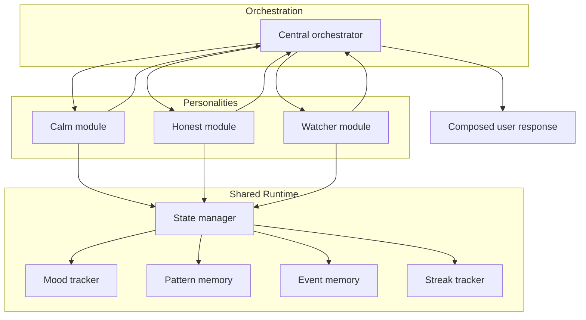
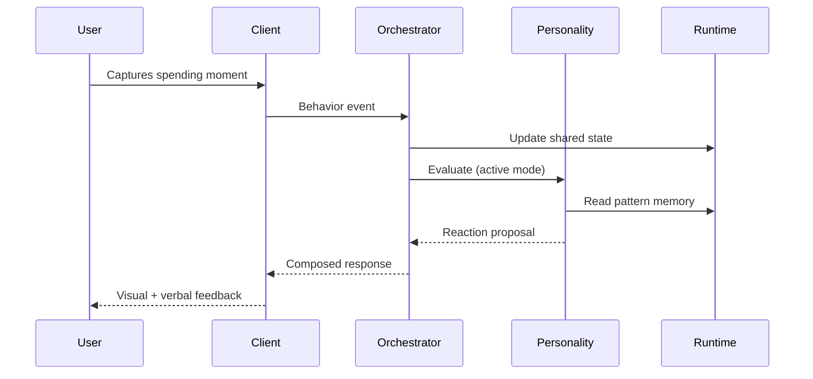

# Personality System

Conceptual architecture for Gareeb's modular companion personalities — how character modes are structured, isolated, and orchestrated as a product system.

---

## System Intent

Personalities are **parallel behavioral lenses** on the same underlying spending data. Users choose one lens; the product maintains consistent voice, thresholds, and feedback channels for that choice.

This is comparable to selecting a communication style in a coaching relationship — the facts do not change, but the **framing** does.

---

## Architecture Overview

---

## Separation of Concerns

| Layer | Owns | Does not own |
|-------|------|--------------|
| **Orchestrator** | Personality selection, confidence blending, final response shape | Category-specific rule semantics |
| **Personality module** | Tone, thresholds, copy direction, visual policy | Shared storage contracts |
| **Shared runtime** | Memory, mood timeline, streaks, pattern state | Personality-specific wording |
| **Models / contracts** | Data shape definitions | Business interpretation |

> **Boundary rule:** Personality-specific interpretation stays inside personality modules. Orchestration stays personality-agnostic.

---

## Module Anatomy (Conceptual)

Each personality module contains equivalent conceptual components:

| Component | Purpose |
|-----------|---------|
| **Engine** | Core interpretation for that personality's philosophy |
| **Rules** | Category and context-specific triggers (coffee, late-night, comfort, etc.) |
| **Memory** | Personality-scoped reaction history and cooldowns |
| **State ladder** | Normal / Suspicious / Warning / Critical mapping |
| **Subtitles / copy pools** | Voice-consistent message inventory |
| **Levels / priority** | Escalation ordering within personality |
| **Config** | Threshold defaults and tuning parameters |

This symmetry allows **parallel product development** — Calm and Honest can evolve independently.

---

## Orchestration Logic

When a spending moment arrives:

1. Shared runtime updates global state.
2. Active personality engine evaluates the moment against its rules.
3. Orchestrator may consult inactive personalities for confidence signals (conceptual blending).
4. Dominant narrative is selected.
5. Final response is composed for the client.

---

## Threshold Philosophy by Module

| Module | Sensitivity | Escalation | Primary channel |
|--------|-------------|------------|-----------------|
| Calm | Low | Slow | Verbal + soft visual |
| Honest | High | Fast | Verbal |
| Watcher | Medium | Medium | Visual + ambient |

Thresholds are **product parameters**, tuned per personality to match user expectation — not universal constants.

---

## Rule Categories (Conceptual)

Both Calm and Honest/Watcher rule sets address similar life domains with different expression:

| Domain | Product question |
|--------|------------------|
| Coffee | Is caffeine comfort becoming a rhythm? |
| Late night | Is time-of-day a spending driver? |
| Shopping | Is discretionary drift visible? |
| Comfort / luxury | Is emotional spending clustering? |
| Restaurant / delivery | Is convenience spend repeating? |
| Fuel / transport | Is mobility cost spiking? |
| Health | Is wellbeing spend unusual? |
| Grocery | Is baseline life cost shifting? |

Rules produce **signals**, not messages. Messages are composed downstream.

---

## Client and Server Roles

| Concern | Direction |
|---------|-----------|
| Personality selection | Client persists user choice |
| Behavior analysis | Server as source of truth for complex pattern resolution |
| Visual assets | Client maps personality to companion imagery |
| Reaction delivery | Client renders composed response |

This split keeps **interpretation authoritative** while preserving **responsive, calm UI** on device.

---

## Adding a New Personality

Product checklist before a new module ships:

- [ ] Defined threshold philosophy
- [ ] Escalation curve documented
- [ ] Copy guardrails (anti-shame review)
- [ ] Visual asset strategy
- [ ] Night behavior specification
- [ ] Verbal vs ambient balance
- [ ] Compatibility with shared runtime contracts
- [ ] Onboarding selection copy

---

## Why Modularity Matters for TPM Review

| Stakeholder concern | How architecture answers |
|---------------------|--------------------------|
| **Scope control** | Personalities ship independently |
| **Regression isolation** | Honest rule change does not break Calm |
| **Team ownership** | Clear module boundaries |
| **Roadmap flexibility** | Fourth personality without rewrite |
| **Quality bar** | Shared contracts, separate tone QA |

---

## Related Documents

- [Personalities](../docs/personalities.md)
- [Behavior Engine](./behavior-engine.md)
- [Pattern Detection](./pattern-detection.md)
