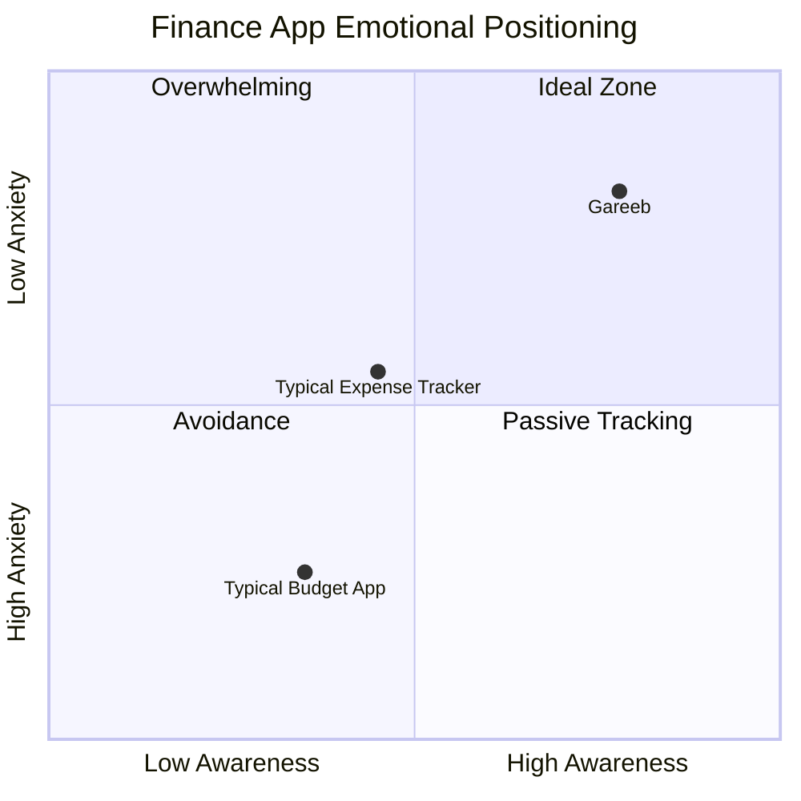

# Before vs With Gareeb

A structured comparison for product reviewers evaluating Gareeb against conventional personal finance approaches.

---

## Executive Summary

| | **Before Gareeb** | **With Gareeb** |
|---|-------------------|-----------------|
| **Mental model** | "I need to track money" | "I need to understand my behavior" |
| **Primary emotion** | Guilt, boredom, avoidance | Curiosity, recognition, calm |
| **Unit of value** | Correct ledger | Meaningful insight |
| **Relationship to app** | Tool used monthly (maybe) | Companion visited in moments |
| **Failure mode** | Abandon after shame spike | Pause, reflect, continue |

---

## User Journey Comparison

### Moment of Purchase

| Stage | Before | With Gareeb |
|-------|--------|-------------|
| **During** | No product presence | Optional future: awareness priming |
| **Immediately after** | Manual entry feels like homework | Quick capture with mood + category |
| **Feedback** | None or generic "saved" | Character-noticed contextual response |
| **Emotional residue** | Neutral or "I should log this later" | "Something noticed this" |

---

### End of Day

| Before | With Gareeb |
|--------|-------------|
| User forgets what they spent | Patterns begin forming from timed entries |
| Mood and money stay disconnected | Daily reflection links feeling to behavior |
| No mirror for impulsive decisions | Companion may quietly reflect repetition |

---

### End of Month

| Before | With Gareeb |
|--------|-------------|
| PDF-style summary or pie chart | Behavioral narrative: what repeated, when, in what mood |
| "You overspent" conclusion | "This rhythm showed up again" observation |
| User closes app feeling judged | User closes app with one clear self-insight |

---

## Feature-Level Contrast

| Capability | Typical expense / budget app | Gareeb |
|------------|------------------------------|--------|
| **Categories** | Accounting taxonomy | Behavioral signals |
| **Totals** | Primary UI | Supporting context |
| **Alerts** | Threshold breaches | Pattern recognition |
| **Character** | Marketing mascot | Functional feedback channel |
| **Mood** | Not captured | First-class context |
| **Personality** | N/A | User-selected interaction mode |
| **Insights** | Static reports | Timed, calibrated responses |
| **Onboarding** | Connect accounts, set budget | Identity + spending tendencies + companion choice |

---

## Emotional UX Comparison

> *Diagram is illustrative — positioning intent, not clinical measurement.*

---

## Persona Snapshots

### Persona A: "The Avoider"

**Before:** Downloads app after overspending → logs three days → sees red budget bar → deletes app.

**With Gareeb:** Chooses Calm personality → logs with mood → receives gentle pattern note → returns next day because tone felt safe.

---

### Persona B: "The Rationalizer"

**Before:** Knows numbers but dismisses them ("Everyone spends on coffee").

**With Gareeb:** Chooses Honest personality → sees direct repetition callout → harder to rationalize because mirror is consistent.

---

### Persona C: "The Observer"

**Before:** Wants data but not noise.

**With Gareeb:** Chooses Watcher personality → ambient visual shifts and minimal copy → awareness without commentary overload.

---

## Why the Difference Matters

Personal finance churn is rarely a **feature gap**. It is a **relationship gap**.

Users leave products that:

1. Make them feel worse about themselves
2. Require effort without emotional payoff
3. Speak in a voice that doesn't match their stress level

Gareeb competes on **relationship quality** and **behavioral insight timing** — not on having more charts than competitors.

---

## Interview Talking Points

Use this document to discuss:

- **Product differentiation** without feature laundry lists
- **Behavioral design choices** with concrete before/after examples
- **Tone and personality** as deliberate product architecture
- **Why "companion" is more accurate than "tracker"**

---

## Related Documents

- [Product Context](./product-context.md)
- [Personalities](./personalities.md)
- [Behavioral Design](./behavioral-design.md)
