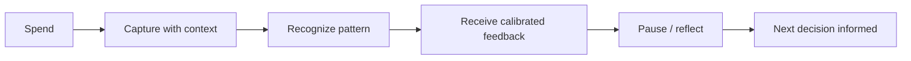

# Behavioral Design

This document explains how Gareeb applies behavioral science and product psychology to financial awareness — without relying on punishment, gamification, or hype.

---

## Behavioral Goal

Gareeb does not try to "fix" users. It tries to **shorten the distance between action and awareness**.

The desired behavioral loop:

---

## Psychological Foundations

### 1. Implementation Intentions (Modified)

Classic implementation intentions ("If X, then Y") often fail in finance because triggers are emotional, not calendar-based.

Gareeb adapts this by linking **category + mood + time** clusters:

| Signal cluster | Example | Product response |
|----------------|---------|------------------|
| Late-night + comfort category | Food delivery after 9 PM | Quiet observation or gentle note |
| Repeated category in short window | Coffee three times before noon | Pattern surfacing, not scolding |
| High single transaction | Unusual amount for category | Surprise reaction calibrated to personality |

The user is not told what to do. They are shown **what keeps happening**.

---

### 2. Self-Awareness Through Externalization

People often rationalize spending in the moment ("I deserved this," "Just this once"). An external companion — especially one with a consistent voice — helps **externalize** the pattern.

Gareeb's character system exists because self-talk is biased. A mirror with personality is less easy to dismiss than a chart.

---

### 3. Affect Labeling

Mood capture at spending time supports **affect labeling** — naming the emotional state associated with a transaction.

Research suggests labeling emotions can reduce impulsive reactivity. Gareeb does not claim clinical outcomes; the product uses mood as **context for reflection**, not diagnosis.

| Mood captured | Design use |
|---------------|------------|
| Stressed | Softer feedback; avoid pile-on |
| Tired | Acknowledge low-energy decisions |
| Happy | Celebrate without encouraging unchecked spend |
| Neutral | Baseline pattern detection |

---

### 4. Variable Reinforcement (Ethical Application)

Unpredictable *positive* presence — a well-timed observation, a quiet visual shift — can maintain engagement without slot-machine mechanics.

Gareeb uses **variable timing of insight**, not variable rewards for spending. The companion may notice something the user did not — creating a moment of curiosity, not dopamine from purchase.

---

### 5. Loss Aversion — Deliberately Softened

Traditional finance apps amplify loss aversion ("You're over budget!"). Gareeb reframes:

| Conventional framing | Gareeb framing |
|---------------------|----------------|
| "You lost $200" | "This category appeared often this week" |
| "Budget exceeded" | "Your rhythm changed compared to last month" |
| "Warning" | "Something is repeating" |

The product acknowledges that **shame triggers avoidance**, and avoidance kills the behavior loop.

---

## Behavioral Design Patterns in Gareeb

### Pattern Surfacing

When the system detects repetition (category frequency, time-of-day clustering, mood correlation), it surfaces a **readable insight** rather than a raw statistic.

**Principle:** One pattern per moment. Cognitive load stays low.

---

### Timing Calibration

Not every signal warrants immediate feedback.

| Urgency | Example | Response style |
|---------|---------|----------------|
| Low | Gradual category drift | Ambient visual shift |
| Medium | Repeat behavior in 24h | Short companion line |
| High | Critical threshold crossed | Direct but personality-appropriate message |

The Watcher personality skews toward ambient observation. Honest skews toward directness. Calm skews toward de-escalation.

---

### Onboarding as Identity Selection

Early onboarding asks users about spending tendencies and **personality preference** — not just salary and categories.

This is behavioral design: users commit to a **relationship style** with the product, increasing follow-through and reducing tone mismatch churn.

---

### Daily Reflection

Daily mood notes create a **parallel emotional timeline** alongside spending data.

Users can review:

- What they felt
- What they spent
- What the companion noticed

This supports retrospective insight without requiring perfect real-time logging.

---

### Financial Awareness Journeys

Monthly rhythms (rollover, fresh perspective, preserved history) frame time as **chapters**, not failures.

When a new month begins, the product resets forward-looking awareness while keeping historical context available — reinforcing learning without erasing the story.

---

## Anti-Patterns (Explicitly Avoided)

| Anti-pattern | Why it fails | Gareeb alternative |
|--------------|--------------|---------------------|
| Shame notifications | Users disable or delete app | Reflective copy |
| Streak punishment | Anxiety, not awareness | Gentle continuity |
| Leaderboards | Irrelevant social comparison | Private pattern view |
| AI mystique | Trust erosion | Explainable behavioral signals |
| Over-notification | Habituation | Timed, personality-filtered responses |

---

## Measurement Philosophy

Gareeb success is measured by **quality of awareness**, not vanity engagement.

| Signal type | What it indicates |
|-------------|-------------------|
| Return after high-spend day | User trusts the product on hard days |
| Mood note completion | Emotional engagement with behavior |
| Personality retention | Tone fit |
| Insight acknowledgment (implicit) | User slowed down before next spend |
| Longitudinal pattern views | Shift from logging to understanding |

---

## Related Documents

- [Design Philosophy](./design-philosophy.md)
- [Pattern Detection](../architecture/pattern-detection.md)
- [Behavior Engine](../architecture/behavior-engine.md)
