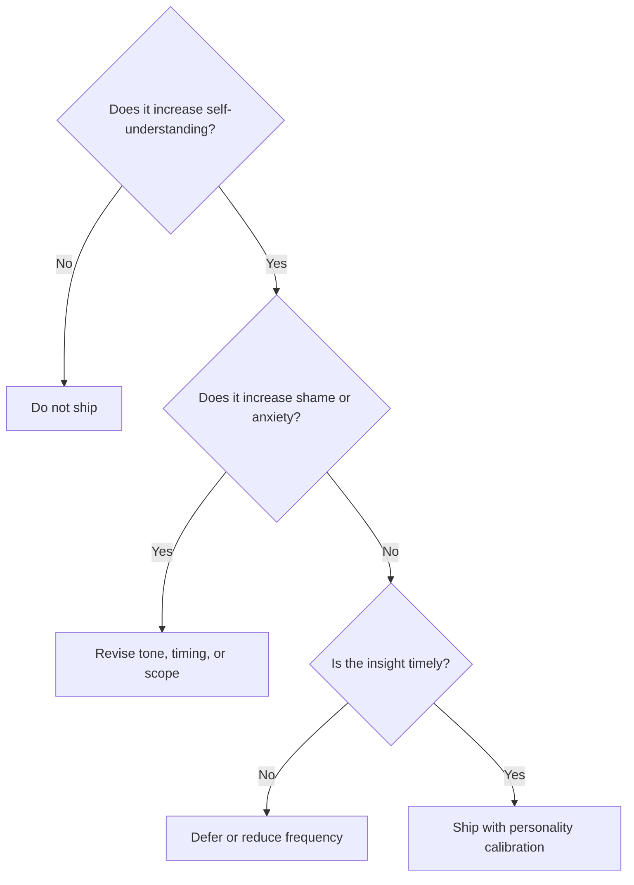

# Design Philosophy

Gareeb is designed around a single belief: **financial behavior changes when people feel seen, not scolded.**

This document defines the product principles that govern UX, content, character behavior, and feature prioritization.

---

## Core Principles

### 1. Awareness Before Control

Budgets assume the user already understands their behavior. Gareeb assumes the opposite.

The product prioritizes **recognition** — helping users notice patterns — before **restriction**. Control features, when present, are downstream of understanding.

> **Design implication:** Insights appear as observations, not verdicts.

---

### 2. The Story Behind the Number

A transaction is an event. A spending behavior is a narrative: time of day, mood, category repetition, social context, emotional state.

Gareeb treats each entry as a **moment in a story**, not a row in a table.

| Element | Role in the story |
|---------|-------------------|
| Category | What was purchased |
| Amount | Weight of the moment |
| Mood | Emotional context |
| Time | Situational context (e.g., late-night spending) |
| Character response | External mirror for self-reflection |

---

### 3. Tone Is a Feature

In finance products, tone is often an afterthought. In Gareeb, tone is **primary interface**.

Users choose a **personality mode** because people receive feedback differently under stress, denial, or motivation.

- Some need gentleness.
- Some need directness.
- Some need quiet observation without commentary overload.

> **Design implication:** Copy, pacing, and visual intensity all adapt to personality mode.

---

### 4. Calm by Default

Financial anxiety is a design constraint, not a user failure.

Gareeb uses:

- Soft visual rhythm (breathing animations, muted palettes)
- Short messages instead of dashboards full of red
- Progressive disclosure — insight when relevant, silence when not

The product should feel **safe to open on a bad day**.

---

### 5. Reflection Over Reporting

Reports describe the past. Reflection connects the past to the present self.

Gareeb favors:

- "This pattern appeared again" over "You exceeded your limit"
- "Late-night orders showed up three times this week" over "Discretionary spend +18%"
- Daily mood notes over monthly guilt summaries

---

### 6. Character as Mirror, Not Authority

The companion character is not a financial advisor, parent, or judge.

It is a **mirror with personality** — reflecting patterns back in a voice the user chose.

| Character role | What it is | What it is not |
|----------------|------------|----------------|
| Observer | Notices repetition | Does not punish |
| Companion | Stays present across sessions | Does not nag endlessly |
| Voice | Adapts to user preference | Does not replace professional advice |

---

## Decision Framework

When evaluating a feature or interaction, the product team applies this framework:

### Evaluation Criteria

| Criterion | Question |
|-----------|----------|
| **Clarity** | Can a non-finance user understand the insight in one read? |
| **Timing** | Does feedback arrive near the behavior, not only at month-end? |
| **Agency** | Does the user feel informed, not controlled? |
| **Tone fit** | Does the message match the selected personality mode? |
| **Repeat safety** | If the user sees this message ten times, does it still feel fair? |

---

## UX Non-Negotiables

1. **No shame-first language** — avoid "failed," "bad," "irresponsible" as default framing.
2. **No alert fatigue** — not every pattern deserves a notification.
3. **No mascot gimmick** — character presence must connect to behavioral signal.
4. **No data without meaning** — charts serve insight, not decoration.
5. **No personality bait-and-switch** — Calm stays calm; Honest stays honest.

---

## Visual and Interaction Language

| Dimension | Direction |
|-----------|-----------|
| Color | Warm neutrals, sage greens, soft lavender accents |
| Typography | Readable Arabic-first; conversational, not corporate |
| Motion | Slow, breathing-like; reactions not explosions |
| Density | Mobile-first; one insight at a time |
| Empty states | Inviting, not accusatory |

---

## What We Optimize For

| Optimized | Deprioritized |
|-----------|---------------|
| Return visits after emotional spending | Same-day log perfection |
| User-described "I noticed myself" moments | Feature count |
| Personality-appropriate feedback | One-size-fits-all copy |
| Long-term pattern memory | Single-transaction novelty |

---

## Related Documents

- [Behavioral Design](./behavioral-design.md)
- [Personalities](./personalities.md)
- [Personality System](../architecture/personality-system.md)
