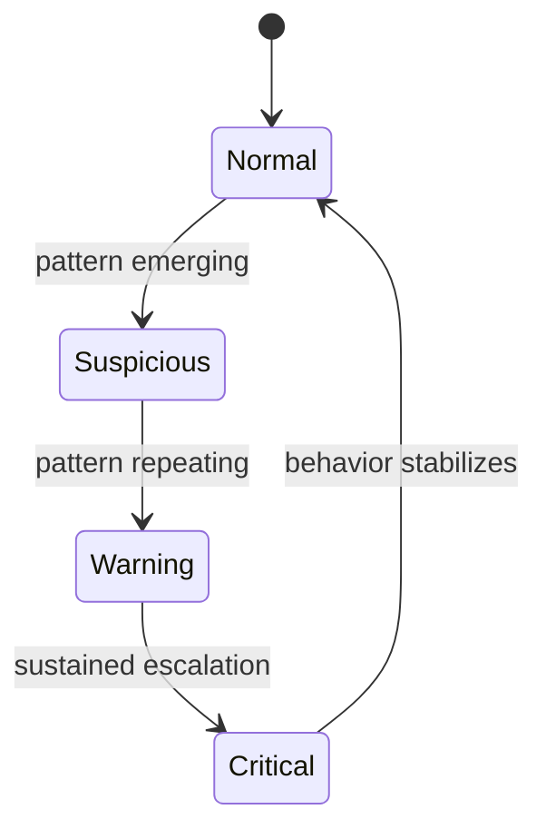

# Personalities

Gareeb's personality system is a **product architecture choice**, not cosmetic theming. Each personality defines how behavioral signals are interpreted, timed, and communicated to the user.

---

## Why Personalities Exist

People do not receive financial feedback uniformly:

| User state | Effective tone |
|------------|----------------|
| Anxious | Gentle, de-escalating |
| Defensive | Direct, consistent |
| Overwhelmed | Minimal, observational |

A single default voice would optimize for one emotional profile and alienate others. Personalities let users **choose the relationship** they want with their financial mirror.

---

## Personality Overview

| Personality | Arabic label | Core stance | Best for |
|-------------|--------------|-------------|----------|
| **Calm** | هادئ | De-escalation and reassurance | Users who shut down under pressure |
| **Honest** | صريح | Direct pattern confrontation | Users who want unfiltered clarity |
| **Watcher** | مراقب | Quiet observation | Users who prefer minimal verbal feedback |

---

## Calm

### Product intent

Calm is the **default companion** for users who need financial awareness without emotional spikes.

### Behavioral posture

- Slow pacing, soft visuals, breathing-like motion
- Warnings arrive as **gentle nudges**, not alarms
- Higher tolerance before escalating feedback intensity
- Night behavior leans toward sleepy, low-energy companion states

### Example feedback direction

| Signal | Calm response style |
|--------|---------------------|
| Rising daily spend | "Let's slow the rhythm a little." |
| Repeat coffee | Quiet side-eye, not lecture |
| Late-night order | Sleepy companion mood; soft acknowledgment |

### Design rationale

Calm protects **return visits**. Users who feel punished stop logging — and stop learning. Calm optimizes for continuity.

---

## Honest

### Product intent

Honest serves users who **already know they rationalize** and want a companion that will not collude with excuses.

### Behavioral posture

- Direct language, shorter sentences
- Lower threshold for surfacing uncomfortable patterns
- Stronger reactions to repetition and escalation
- Night behavior: direct reminders rather than soft fade

### Example feedback direction

| Signal | Honest response style |
|--------|----------------------|
| Rising daily spend | Clear statement that pace changed |
| Repeat behavior | "Didn't we see this recently?" framing |
| Critical threshold | Explicit urgency without insult |

### Design rationale

Honest is not cruelty — it is **consistency**. Some users trust a product more when it refuses to soften obvious patterns.

---

## Watcher

### Product intent

Watcher is for users who find **verbal feedback noisy**. Awareness comes through presence, visual state, and timing — not constant copy.

### Behavioral posture

- Minimal dialogue; empty states are intentional
- Ambient visual overlays (late-night dimming, emotional tint)
- Pattern reactions often **visual-first**
- Short, rare verbal moments for high-signal events

### Example feedback direction

| Signal | Watcher response style |
|--------|------------------------|
| Rising daily spend | Visual state shift |
| Repeat category | Subtle companion change |
| Coffee rush pattern | Brief "aha" moment — then silence |

### Design rationale

Watcher respects **attention economics**. Not every user wants a chatty companion. Observation alone can be enough for awareness.

---

## Personality Comparison Matrix

| Dimension | Calm | Honest | Watcher |
|-----------|------|--------|---------|
| Verbal density | Medium | High | Low |
| Escalation speed | Slow | Fast | Medium |
| Sarcasm level | Low | High | Medium-low |
| Visual intensity | Soft | Expressive | Ambient |
| Ideal user | Anxiety-sensitive | Self-rationalizers | Minimalists |
| Risk if mis-selected | Too passive for some | Too intense for anxious users | Too quiet for users needing words |

---

## State Ladder (Shared Model)

All personalities share a **four-stage interpretation ladder** for behavioral intensity:

What changes between personalities is **how each stage is expressed** — not whether the stage exists.

| Stage | Calm expression | Honest expression | Watcher expression |
|-------|-----------------|-------------------|---------------------|
| Normal | Peaceful default | Neutral baseline | Silent presence |
| Suspicious | Soft hmm | Direct doubt | Visual shift |
| Warning | Gentle alert | Clear callout | Stronger ambient cue |
| Critical | Firm but kind stop | Explicit urgency | Rare verbal + visual |

---

## Selection and Persistence

Users choose a personality during onboarding. The choice persists as part of their **product identity** — influencing copy pools, reaction timing, visual assets, and threshold sensitivity.

> **Product rule:** Personalities never mock the user. Even Honest speaks to *behavior*, not *character*.

---

## Content Guidelines by Personality

| Rule | Calm | Honest | Watcher |
|------|------|--------|---------|
| Insult user | Never | Never | Never |
| Name pattern | Sometimes | Always | Visually |
| Humor | Light | Dry | Rare |
| Arabic tone | Warm | Blunt | Sparse |
| Repeat message safety | Must stay kind | Must stay factual | Must stay brief |

---

## Future Personality Expansion

The system is designed for **modular addition** — new personalities must define:

1. Threshold philosophy
2. Night behavior
3. Verbal vs visual balance
4. Escalation curve
5. Anti-shame guardrails

Adding a personality is a **product decision**, not an asset swap.

---

## Related Documents

- [Personality System](../architecture/personality-system.md)
- [Behavior Engine](../architecture/behavior-engine.md)
- [Design Philosophy](./design-philosophy.md)
