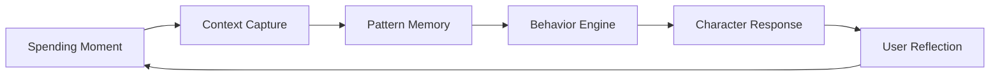

# Product Context

> **Gareeb** is a behavioral finance companion that helps people understand the *story behind their spending* — not just the numbers.

---

## The Problem

Most people do not struggle with recording transactions. They struggle with **understanding why spending happens**, **recognizing repeating patterns**, and **changing behavior without feeling judged**.

Traditional personal finance tools optimize for:

- Ledger accuracy
- Category totals
- Budget thresholds
- Dashboard density

These tools answer: *"How much did I spend?"*

They rarely answer:

- *"Why does this keep happening?"*
- *"What mood or moment drives this pattern?"*
- *"What would awareness look like before the next decision?"*

The result is a familiar cycle: download → log for two weeks → feel guilty or bored → abandon.

---

## Who Gareeb Is For

Gareeb is designed for people who:

- Want **financial awareness**, not a spreadsheet replacement
- Respond better to **reflection** than to red warning banners
- Need a **companion tone** that matches their emotional bandwidth
- Prefer **small, honest moments of insight** over monthly lecture-style reports

| User signal | What they need | What Gareeb provides |
|-------------|----------------|----------------------|
| "I know I overspend but can't stop" | Pattern visibility | Behavioral recognition over time |
| "Finance apps make me feel bad" | Non-punitive framing | Reflective, character-led feedback |
| "I forget why I bought things" | Context capture | Mood-linked spending moments |
| "I want something human" | Emotional UX | Personality modes with distinct voices |

---

## Product Scope

Gareeb intentionally combines several product layers into one coherent experience:

### In Scope

| Capability | Product intent |
|------------|----------------|
| **Spending tracking** | Capture moments with category and emotional context |
| **Pattern detection** | Surface repetition across time, category, and mood |
| **Behavioral insights** | Translate patterns into readable, actionable awareness |
| **Character-driven feedback** | Deliver insights through a chosen companion personality |
| **Personality modes** | Let users select the tone that fits their relationship with money |
| **Daily reflections** | Short mood notes that connect feelings to financial behavior |
| **Awareness journeys** | Onboarding and monthly rhythms that build self-understanding |
| **Emotional UX** | Visual calm, pacing, and language that reduce finance anxiety |

### Out of Scope (By Design)

- Investment advice
- Bank aggregation as the primary value proposition
- Competitive gamification or streak punishment
- Shame-based alerts or public social comparison

---

## Why Now

Behavioral finance research consistently shows that **awareness precedes change**. People do not lack data — they lack **interpretation**, **timing**, and **tone**.

Gareeb sits in the gap between:

- **Passive tracking** (records the past)
- **Aggressive budgeting** (controls the future)

It focuses on the present: *the moment of decision and the moment after*.

---

## Product Positioning

| Dimension | Conventional tools | Gareeb |
|-----------|-------------------|--------|
| Primary unit | Transaction | Behavior moment |
| Success metric | Log completeness | Awareness quality |
| Feedback style | Alerts and charts | Reflection and character |
| Emotional stance | Neutral or punitive | Calibrated companionship |
| Long-term goal | Budget adherence | Financial self-understanding |

---

## Strategic Intent

Gareeb is built as a **behavioral product**, not a ledger with a mascot.

Every major product decision — from onboarding copy to personality thresholds to insight timing — is evaluated against one question:

> *Does this help the user understand themselves better, without making them feel worse?*

If the answer is no, the feature does not ship in its current form.

---

## Related Documents

- [Design Philosophy](./design-philosophy.md)
- [Behavioral Design](./behavioral-design.md)
- [Before vs With Gareeb](./before-vs-with-gareeb.md)
