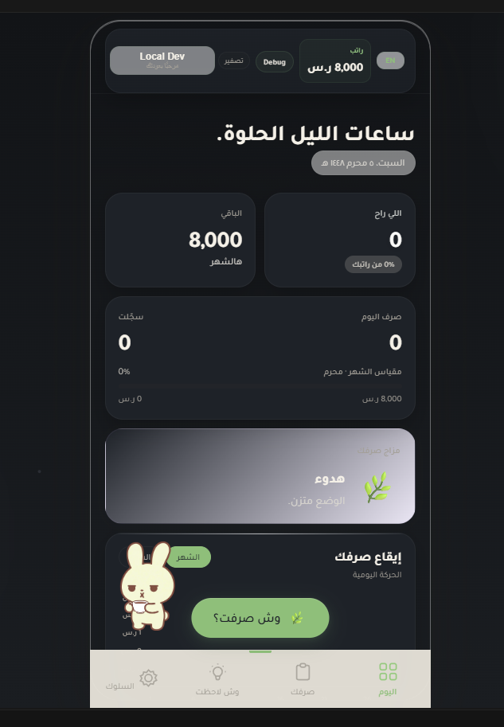
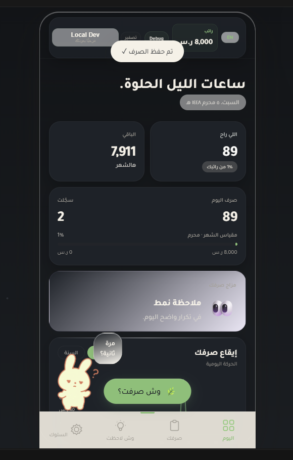
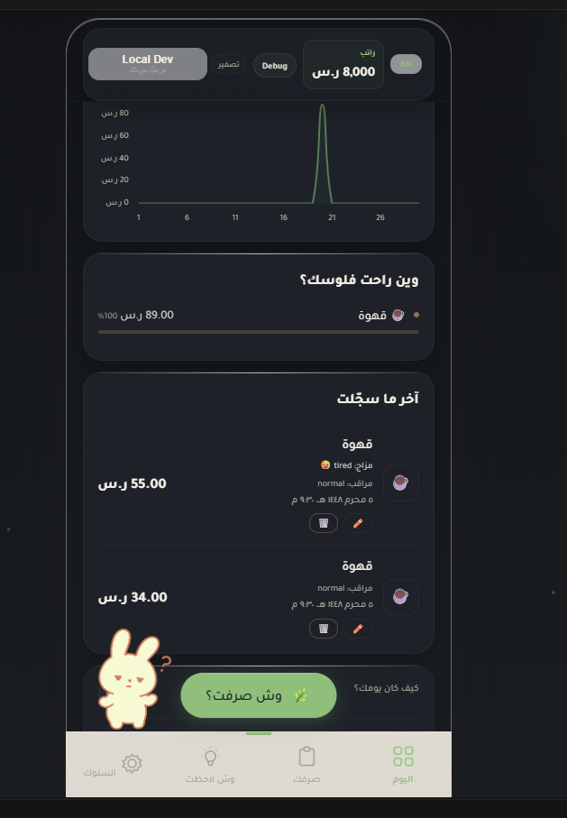
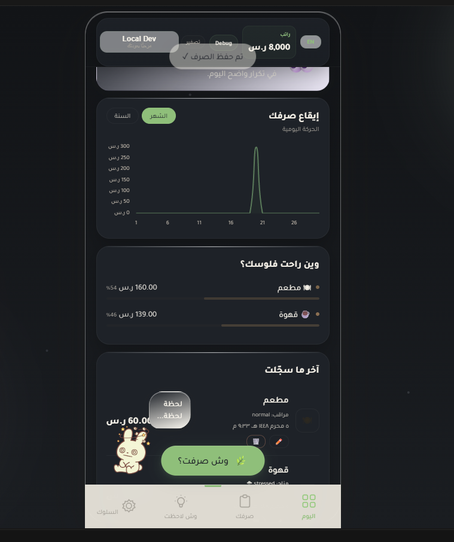
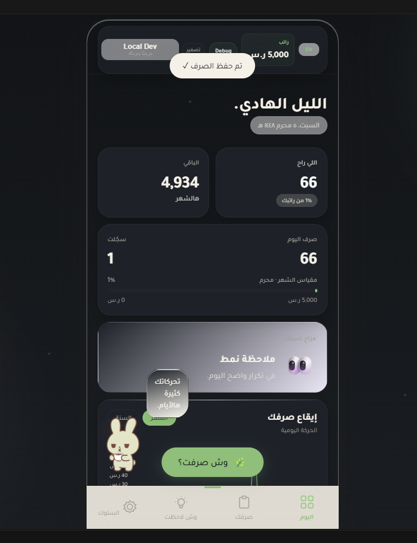
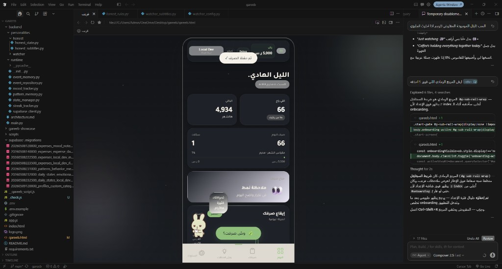
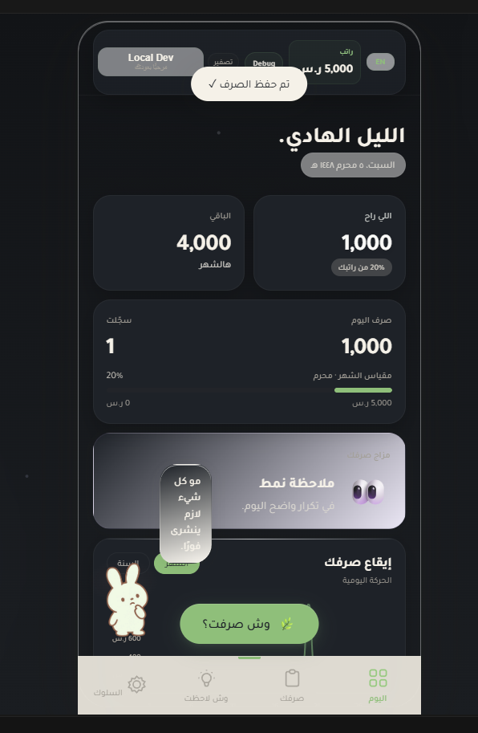
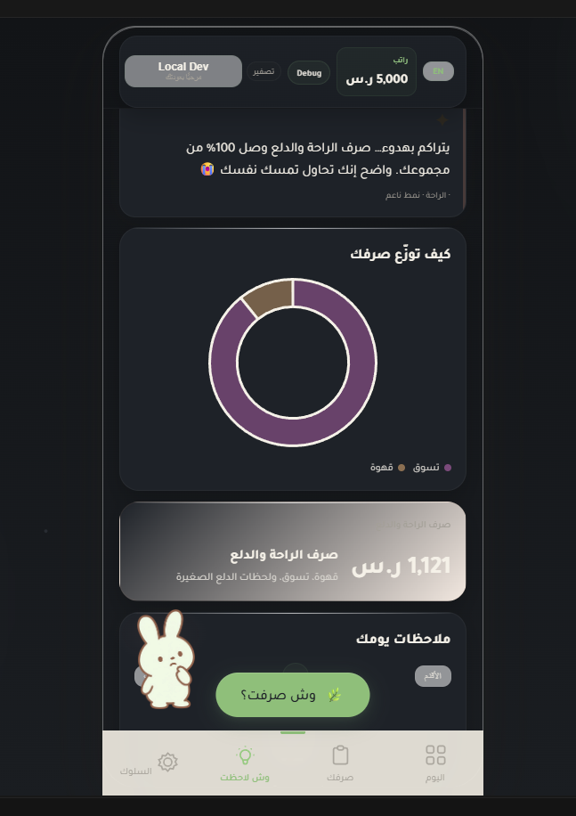
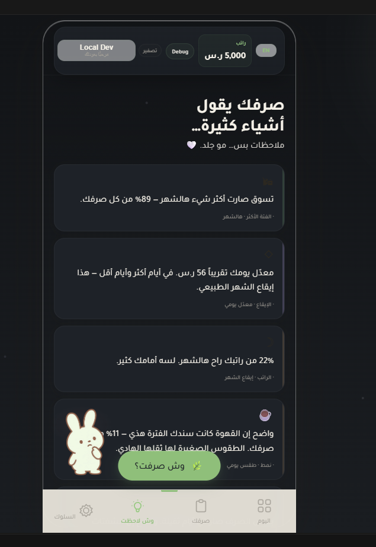

# Screenshots — جولة في التطبيق

15 لقطة مرتّبة حسب **رحلة المستخدم** من أول فتح للتطبيق إلى الملاحظات السلوكية.

> **ملاحظة:** التطبيق حالياً يدخل مباشرة بدون تسجيل دخول (وضع ضيف). «الدخول» هنا = **الإعداد الأول** ثم **الصفحة الرئيسية**.

---

## 1 · الإعداد الأول (Onboarding)

| # | الصفحة | الملف | ماذا تُظهر؟ |
|---|--------|-------|-------------|
| **1** | **ترحيب — بداية الإعداد** | [`01-onboarding-welcome.png`](01-onboarding-welcome.png) | شعار قريب، نص الترحيب («رفيقك الهادي في عالم الفلوس»)، زر **ابدأ معاي** أو تخطّي |
| **2** | **عادات الصرف** | [`03-onboarding-spending-habits.png`](03-onboarding-spending-habits.png) | «وش أكثر شيء يطير راتبك؟» — اختيار فئات (قهوة، طلعات، طلبات…) |
| **3** | **اختيار شخصية قريب** | [`04-onboarding-persona.png`](04-onboarding-persona.png) | هادي / يراقب / صريح — كيف يتكلم معك قريب |

---

## 2 · الصفحة الرئيسية — تبويب «اليوم»

| # | الصفحة | الملف | ماذا تُظهر؟ |
|---|--------|-------|-------------|
| **4** | **أول دخول — شهر فارغ** | [`02-home-first-open.png`](02-home-first-open.png) | الرئيسية بعد الإعداد: راتب، صرف 0، مزاج هادئ، زر **وش صرفت؟** |
| **5** | **نظرة الشهر** | [`05-home-overview.png`](05-home-overview.png) | ملخص: اللي راح / الباقي، شريط الراتب، بطاقة المزاج |
| **6** | **بعد تسجيل صرف** | [`07-home-activity-logged.png`](07-home-activity-logged.png) | أول عمليات مسجّلة + ملاحظة نمط من قريب |
| **7** | **آخر العمليات + رسم** | [`08-home-recent-expenses.png`](08-home-recent-expenses.png) | «وين راحت فلوسك؟»، قائمة آخر ما سجّلت، رسم يومي |
| **8** | **إيقاع الشهر** | [`09-home-monthly-chart.png`](09-home-monthly-chart.png) | رسم شهري + توزيع الفئات (مطعم، قهوة…) |

---

## 3 · إدخال مشترى / صرف

| # | الصفحة | الملف | ماذا تُظهر؟ |
|---|--------|-------|-------------|
| **9** | **إضافة صرف** | [`06-spending-entry.png`](06-spending-entry.png) | «وش صرفت؟» — المبلغ، الفئة، المزاج (اختياري)، ملاحظة |

---

## 4 · قريب يتفاعل (شخصية «يراقب»)

لقطات من **نفس الصفحة الرئيسية** لكن قريب يلاحظ نمطاً ويظهر سطر تعليق:

| # | الصفحة | الملف | ماذا تُظهر؟ |
|---|--------|-------|-------------|
| **10** | **ملاحظة — قهوة** | [`10-companion-watcher-coffee.png`](10-companion-watcher-coffee.png) | تكرار القهوة: «مرة ثانية؟» |
| **11** | **ملاحظة — بنزين** | [`11-companion-watcher-fuel.png`](11-companion-watcher-fuel.png) | تحرك كثير: «تحركاتك كثيرة هالأيام» |
| **12** | **ملاحظة — تسوق** | [`12-companion-watcher-shopping.png`](12-companion-watcher-shopping.png) | اندفاع شراء: «مو كل شيء لازم ينشرى فوراً» |

---

## 5 · تبويب «وش لاحظت» (Insights)

| # | الصفحة | الملف | ماذا تُظهر؟ |
|---|--------|-------|-------------|
| **13** | **ملاحظات عامة** | [`13-behavior-insights.png`](13-behavior-insights.png) | بطاقات ملاحظات: فئة مسيطرة، راتب، صرف عاطفي… |
| **14** | **توزيع الصرف + الراحة** | [`14-insights-distribution.png`](14-insights-distribution.png) | دائرة الفئات + ملخص «صرف الراحة والدلع» |
| **15** | **أنماط مفصّلة** | [`15-behavior-insights-patterns.png`](15-behavior-insights-patterns.png) | بطاقات أكثر: متوسط يومي، قهوة، راحة ودلع… |

---

## خريطة سريعة (User flow)

```
ترحيب → عادات الصرف → شخصية قريب
              ↓
         الصفحة الرئيسية (اليوم)
              ↓
      إدخال صرف ← → قريب يلاحظ
              ↓
         وش لاحظت (Insights)
```

---

## Gallery (visual)

### الإعداد الأول
| ترحيب | عادات الصرف | شخصية قريب |
|:---:|:---:|:---:|
|  |  |  |

### اليوم — الرئيسية
| أول دخول | نظرة الشهر | بعد الصرف |
|:---:|:---:|:---:|
|  |  |  |
| آخر العمليات | إيقاع الشهر | |
|  |  | |

### إدخال صرف
| إضافة مشترى |
|:---:|
|  |

### قريب يراقب
| قهوة | بنزين | تسوق |
|:---:|:---:|:---:|
|  |  |  |

### وش لاحظت
| ملاحظات | توزيع | أنماط |
|:---:|:---:|:---:|
|  |  |  |

---

## English index (for reviewers)

| File | Screen |
|------|--------|
| `01-onboarding-welcome.png` | Onboarding — welcome |
| `02-home-first-open.png` | Today — first open (empty month) |
| `03-onboarding-spending-habits.png` | Onboarding — spending habits |
| `04-onboarding-persona.png` | Onboarding — personality pick |
| `05-home-overview.png` | Today — salary overview |
| `06-spending-entry.png` | Add expense sheet |
| `07-home-activity-logged.png` | Today — after logging spends |
| `08-home-recent-expenses.png` | Today — recent list + chart |
| `09-home-monthly-chart.png` | Today — monthly rhythm |
| `10-companion-watcher-coffee.png` | Watcher — coffee pattern |
| `11-companion-watcher-fuel.png` | Watcher — fuel / mobility |
| `12-companion-watcher-shopping.png` | Watcher — shopping impulse |
| `13-behavior-insights.png` | Insights — observation cards |
| `14-insights-distribution.png` | Insights — category donut |
| `15-behavior-insights-patterns.png` | Insights — pattern breakdown |

---

## Usage

- بيانات تجريبية فقط — آمنة للمعرض والـ portfolio.
- الترتيب الرقمي (01–15) يتبع **مسار المستخدم**، مو ترتيب رفع الملفات.
